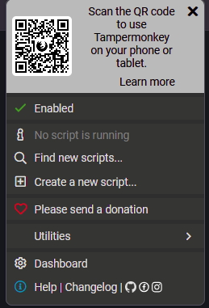

# Lectio Scripts

Small **Tampermonkey userscripts** that add useful features to [Lectio](https://www.lectio.dk/).

The scripts are ordinary JavaScript files that run **in your own browser** while you use Lectio. They do not replace Lectio and do not require a separate program once Tampermonkey is installed.

## Available scripts

| Script | What it does | Intended for | Lectio compatibility |
|---|---|---|---|
| **[Chairs Up](scripts/Chairs%20Up.js)** | Marks lessons that are the **last booking of the day in their room**, so the teacher knows when chairs should be put up. | Teachers | Currently configured for school ID **223** |
| **[English Mode](scripts/English%20Mode.js)** | Adds a **DA / EN** switch to Lectio and translates the interface into context-aware English. | Students and staff | All Lectio schools |
| **[Unread Message Notifications](scripts/Unread%20Message%20Notifications.js)** | Shows unread Lectio messages beside **Beskeder / Messages** and plays a soft Lectio chime when the unread count increases. | Students and staff | All Lectio schools |

You can install **one, two, or all three**. They are independent scripts.

> [!NOTE]
> This is an unofficial project. It is not made by, affiliated with, or endorsed by Lectio or Tampermonkey.

---

# Quick start

For most people, installation is:

1. Install **Tampermonkey**.
2. Open the script you want from the [`/scripts`](scripts/) folder.
3. Copy the complete JavaScript file.
4. Click the Tampermonkey icon and choose **Create a new script...**
5. Delete the example code and paste in the Lectio script.
6. Save.
7. Reload Lectio.

Current Tampermonkey menu:



The detailed instructions below walk through every step.

---

# 1. Install Tampermonkey

Tampermonkey is a browser extension that runs **userscripts**: small JavaScript programs that add or change functionality on websites.

## Get Tampermonkey

Use the official site:

**[tampermonkey.net](https://www.tampermonkey.net/)**

Tampermonkey is available for major browsers including:

- Google Chrome
- Mozilla Firefox
- Microsoft Edge
- Safari
- Opera

Install it through the normal extension/add-on store for your browser.

---

## Chrome and Microsoft Edge: allow userscripts

Current versions of Tampermonkey on Chromium-based browsers require permission to execute userscripts.

If you use **Chrome or Edge** and your installed scripts do not run, check this first.

### Chrome 138 and newer

1. Right-click the Tampermonkey icon.
2. Choose **Manage extension**.
3. Enable **Allow User Scripts**.

Official Tampermonkey screenshots:


If **Allow User Scripts** is not available, Tampermonkey's current instructions say to enable **Developer Mode** on your browser's extensions page instead.

Official instructions:

**[Tampermonkey — Permission to execute userscripts](https://www.tampermonkey.net/faq.php?locale=en&q=Q209)**

Firefox users do not normally need this Chromium-specific step.

---

# 2. Choose a Lectio script

All scripts are stored in this repository's:

**[`/scripts` folder](scripts/)**

Current files:

### Chairs Up

**[Open `Chairs Up.js`](scripts/Chairs%20Up.js)**

Shows a **CHAIRS UP** reminder when one of your lessons is the final booking of the day in that room.

It works on the Lectio timetable and relevant activity pages and caches room information so it does not need to repeatedly reload the same room schedule.

**Current school configuration:** Lectio school ID `223`.

---

### English Mode

**[Open `English Mode.js`](scripts/English%20Mode.js)**

Adds a small **DA / EN** switch to Lectio.

- **DA** leaves Lectio in Danish.
- **EN** translates the Lectio interface into English.
- Your selected language is remembered.
- Common Lectio interface terms are translated directly by the script.
- Additional text can use Google Translate as a fallback.

The script is configured to run on:

```text
https://www.lectio.dk/lectio/*
```

so it is not tied to one specific school ID.

---

### Unread Message Notifications

**[Open `Unread Message Notifications.js`](scripts/Unread%20Message%20Notifications.js)**

Adds an unread-message indicator beside **Beskeder / Messages**.

The script checks for unread messages:

- once when a Lectio page loads
- every **10 minutes** if you stay on the same page
- when you return to a Lectio tab, if at least 10 minutes have passed since the previous check

A soft Lectio chime plays **only when the unread count increases**.

The first successful check establishes a baseline, so installing the script while you already have unread messages should not immediately produce a notification sound.

**Current school configuration:** Lectio school ID `223`.

---

# 3A. Phones and tablets

**Yes, Tampermonkey can run on supported phones and tablets**, but the installation route depends on the browser.

- **Android:** use Microsoft Edge or Firefox; standard Chrome for Android does not install extensions.
- **iPhone/iPad:** Tampermonkey is available for Safari through the App Store.

See the **Mobile and tablet support** section below for the detailed setup and the limitations of background message checking.

---

# 3. Recommended installation: copy and paste

The files in this repository currently end in ordinary **`.js`** rather than **`.user.js`**.

Because of that, the most reliable installation method is to copy the script into Tampermonkey.

## Step 1 — Open the script on GitHub

Open the script you want from the [`/scripts`](scripts/) folder.

For example:

**[`scripts/English Mode.js`](scripts/English%20Mode.js)**

---

## Step 2 — Copy the entire file

On the GitHub file page, use **Copy raw file**, or click **Raw** and then copy everything.

You must copy the **entire script**, beginning with the userscript header:

```javascript
// ==UserScript==
// @name         ...
// @description  ...
// @match        ...
// ...
// ==/UserScript==
```

Do not remove this header. Tampermonkey uses it to determine the script's name, permissions, and the websites on which it is allowed to run.

---

## Step 3 — Open Tampermonkey

Click the Tampermonkey icon in your browser toolbar.

If you cannot see the icon, open your browser's extension menu and pin Tampermonkey.

In current Tampermonkey versions, the popup includes:

**Create a new script...**


Click **Create a new script...**.

> [!TIP]
> You can also open **Dashboard** and create a script from there, but the direct **Create a new script...** menu item is the quickest route.

---

## Step 4 — Create the script

Tampermonkey will open its code editor with an example userscript.

---

## Step 5 — Remove Tampermonkey's example code

Click inside the editor and select everything:

- Windows/Linux: **Ctrl + A**
- macOS: **Cmd + A**

Delete it.

---

## Step 6 — Paste the Lectio script

Paste the complete JavaScript code you copied from GitHub.

---

## Step 7 — Save

Save the script using:

- Windows/Linux: **Ctrl + S**
- macOS: **Cmd + S**

or use Tampermonkey's **File → Save** command.

The script should now appear in your list of installed userscripts.

---

## Step 8 — Reload Lectio

Return to Lectio and reload the page.

The script should start automatically on the Lectio pages specified in its `@match` rules.

Tampermonkey's own userscript-installation instructions are available here:

**[Tampermonkey — How to install new scripts](https://www.tampermonkey.net/faq.php?q=Q102)**

---

# 4. Alternative: try GitHub Raw

Tampermonkey officially supports installing userscripts from GitHub by opening the script's **Raw** view.

However, Tampermonkey conventionally recognizes installable files ending in **`.user.js`**, while the files in this repository currently end in plain `.js`.

You can still try:

1. Open a script on GitHub.
2. Click **Raw**.
3. If Tampermonkey opens an installation screen, review the script and click **Install**.
4. If your browser simply displays JavaScript text, use the **copy-and-paste method above**.

Raw source links:

- **[Chairs Up — Raw](https://raw.githubusercontent.com/RktRobinhood/Lectio-Scripts/main/scripts/Chairs%20Up.js)**
- **[English Mode — Raw](https://raw.githubusercontent.com/RktRobinhood/Lectio-Scripts/main/scripts/English%20Mode.js)**
- **[Unread Message Notifications — Raw](https://raw.githubusercontent.com/RktRobinhood/Lectio-Scripts/main/scripts/Unread%20Message%20Notifications.js)**

---

# 5. Installing more than one script

You can install all three scripts.

Repeat the copy-and-paste process for each file:

1. Open the script on GitHub.
2. Copy the complete file.
3. Click the Tampermonkey icon.
4. Choose **Create a new script...**.
5. Delete the template.
6. Paste.
7. Save.
8. Repeat for the next script.
9. Reload Lectio when finished.

Each script should appear as a separate entry in the Tampermonkey Dashboard.

---

# 6. How to check whether a script is running

If a script appears not to work:

1. Open Lectio.
2. Click the Tampermonkey icon.
3. Check that Tampermonkey is enabled.
4. Open **Dashboard**.
5. Find the Lectio script.
6. Make sure its switch/status is **Enabled**.
7. Reload Lectio.

Tampermonkey normally also shows which installed userscripts match the page you currently have open.

---

# 7. First-use notes for each script

## Chairs Up

On supported timetable/activity pages, lessons that are the last booking in their room should receive a visible **CHAIRS UP** indication.

The script checks the room's Lectio schedule rather than simply assuming that your lesson is the final class on your personal timetable.

Because room data is cached, an initial check may involve more work than later page loads.

---

## English Mode

After installation, look near the upper-right area of Lectio for the small:

**DA | EN**

control.

Choose **EN** to switch to English.

Changing language reloads the current Lectio page so the script can start from Lectio's original Danish page rather than trying to reverse previously translated text.

Your selection is remembered for future Lectio pages.

---

## Unread Message Notifications

The unread-message badge should appear beside **Beskeder** or **Messages**.

For notification sound:

- browsers may block audio until you interact with the page
- click, tap, or press a key once on a Lectio page to allow the script to arm its chime
- make sure the Lectio tab is not muted
- check your browser/operating-system audio settings if necessary

The script intentionally checks at a modest rate rather than continuously requesting the inbox.

---

# 7A. Mobile and tablet support

**Yes — these userscripts can potentially run on phones and tablets as well as computers.**

The important limitation is that the mobile browser must support Tampermonkey or another compatible userscript manager. Mobile Chrome is **not** the same as desktop Chrome in this respect.

## Android

### Recommended: Microsoft Edge

Microsoft now provides an **Extensions for Mobile** collection for Edge on Android, and **Tampermonkey is one of the extensions offered there**.

1. Install **Microsoft Edge** on the Android phone/tablet.
2. Install **Tampermonkey** from Edge's mobile extensions collection.
3. Open Lectio in Edge.
4. Open Tampermonkey.
5. Create a new script and paste the Lectio script, just as on desktop.
6. Reload Lectio.

Official links:

- **[Microsoft Edge — Extensions for Mobile](https://microsoftedge.microsoft.com/addons/collections/mobile_android_extensions)**
- **[Tampermonkey — official versions / mobile options](https://www.tampermonkey.net/faq.php?q=Q406)**

### Also supported: Firefox for Android

Tampermonkey also has an official **Firefox Android** add-on.

1. Install **Firefox** on Android.
2. Install Tampermonkey from Mozilla's Android add-on page.
3. Open Lectio in Firefox.
4. Add the userscript to Tampermonkey.
5. Reload Lectio.

Official link:

- **[Tampermonkey for Firefox Android](https://addons.mozilla.org/en-US/android/addon/tampermonkey/)**

### Google Chrome on Android

Standard **Chrome for Android does not install Chrome extensions**.

Google's current Chrome Web Store help states that extensions can only be used on computers, not mobile devices.

So, on Android, use **Edge** or **Firefox** rather than Chrome if you want these Lectio userscripts.

---

## iPhone and iPad

Tampermonkey is available as a **Safari extension/app for iPhone and iPad**.

The current App Store version requires:

- **iOS 15 or later** on iPhone
- **iPadOS 15 or later** on iPad

Install Tampermonkey from the App Store, enable it for Safari, then open Lectio in Safari and install/add the userscript there.

Official links:

- **[Tampermonkey on the Danish App Store](https://apps.apple.com/dk/app/tampermonkey/id6738342400)**
- **[Tampermonkey — official versions](https://www.tampermonkey.net/faq.php?q=Q406)**

> [!NOTE]
> The iPhone/iPad version is an App Store product and may not be free. App Store price and availability can change.

---

## Will these particular Lectio scripts work on mobile?

They are ordinary webpage userscripts rather than desktop applications, so there is no fundamental reason they must be limited to a computer. However, **mobile testing should currently be considered experimental** until each script has been tested on the relevant browser/device.

### English Mode

**Expected to work reasonably well.**

It runs on all Lectio school pages and uses standard Tampermonkey APIs for storage and translation requests.

Potential mobile issues are mainly:

- the **DA / EN** control may need layout adjustments on very narrow screens
- translated Lectio elements can have different wrapping on mobile
- the same Google Translate privacy considerations described elsewhere in this README still apply

If you test it successfully on a particular phone/browser combination, please report that in GitHub Issues so confirmed platforms can be documented.

### Chairs Up

**Likely to work, but needs mobile layout testing.**

The underlying logic uses ordinary webpage requests and Lectio's timetable information. The main uncertainty is presentation: Lectio's mobile layout may place lesson elements differently or make the reminder too large/small.

If the logic works but the badge/display looks wrong, use a **Feature / maker idea** or **School compatibility** Issue and include a redacted screenshot.

### Unread Message Notifications

**The unread badge/checking logic should be capable of running on mobile, but this is not a true background push-notification service.**

The current script deliberately checks:

- when a Lectio page loads
- every 10 minutes **while the Lectio tab is visible**
- when you return to the Lectio tab after 10 or more minutes

Phones aggressively suspend background browser tabs to save power. Therefore:

> [!IMPORTANT]
> Do **not** expect this userscript to notify you reliably while the browser is closed, while Lectio has been suspended in the background, or when no Lectio page is open.

When you return to Lectio, the script is designed to notice that the page has become visible again and check if enough time has passed.

The notification chime may also require you to tap/interact with the Lectio page once because mobile browsers apply strict autoplay/audio rules.

So on a phone, think of this script as:

**"Make unread messages obvious whenever I am using Lectio"**

rather than:

**"Replace a native push-notification service even when Lectio is closed."**

---

## Mobile compatibility reports are especially useful

If you try one of the scripts on mobile, a GitHub Issue can help establish a tested compatibility matrix.

Useful information:

```text
Device: iPhone 15 / Pixel 9 / iPad / etc.
OS: iOS 19 / Android 17 / etc.
Browser: Safari / Edge / Firefox
Browser version:
Tampermonkey version:
Script:
Script version:

Works:
- ...

Problems:
- ...

Console errors:
[redacted output if relevant]
```

Do not include private Lectio data.

---

# 8. Important privacy note for English Mode

**English Mode can use Google Translate as a fallback.**

Common Lectio navigation/interface terms are handled directly by the script, but text that the script does not already know may be sent to Google's translation endpoints in order to obtain an English translation.

The script currently declares access to:

```text
translate.googleapis.com
translate.google.com
```

This means you should consider your school's privacy/data-protection requirements before using English Mode on pages containing confidential or personally identifiable information.

If your institution does not permit this type of external translation, do not use **EN mode** on sensitive Lectio pages.

The other scripts do not declare these Google Translate connections.

---

# 9. School ID 223

Two scripts are currently written specifically for Lectio school ID:

```text
223
```

These are:

- **Chairs Up**
- **Unread Message Notifications**

This is visible in URLs such as:

```text
https://www.lectio.dk/lectio/223/...
```

If you are a student or teacher at the school for which these scripts were created, no change is required.

## Other Lectio schools

**English Mode** should work without changing the school ID.

**Unread Message Notifications** can potentially be adapted to another school by changing its school-specific `223` values.

**Chairs Up** is more school-specific because it also uses room information from the school's Lectio setup. Adapting it to another school may require changing both the school ID and the room-discovery configuration.

If you want to adapt the scripts for another Lectio school, fork the repository or open an Issue rather than blindly replacing numbers without testing.

---

# 10. Updating a script

The current scripts do **not** contain GitHub `@updateURL` / `@downloadURL` metadata.

That means a script installed by copy-paste should be treated as a **manual installation**.

To update:

1. Open the newest version of the script in this repository.
2. Copy the complete current file.
3. Open **Tampermonkey → Dashboard**.
4. Click the installed script.
5. Select all of the old code.
6. Paste the new version over it.
7. Save.
8. Reload Lectio.

The version number is stored near the top of each script in its userscript header:

```javascript
// @version ...
```

You can compare that number with the version installed in Tampermonkey.

---

# 11. Temporarily disabling a script

You do not need to delete a script just to test Lectio without it.

1. Open **Tampermonkey → Dashboard**.
2. Find the script.
3. Switch it **Off**.
4. Reload Lectio.

Switch it back on when you want to use it again.

---

# 12. Removing a script

To remove one completely:

1. Open **Tampermonkey → Dashboard**.
2. Select the script.
3. Choose **Delete / Remove**.
4. Reload Lectio.

Nothing needs to be uninstalled from Lectio itself.

---

# 13. Troubleshooting

## The script is installed but nothing happens

Check:

- Tampermonkey is enabled.
- The individual script is enabled.
- You reloaded Lectio after installation.
- The current Lectio URL matches the script's `@match` rule.
- Chrome/Edge has **Allow User Scripts** or the required Developer Mode permission enabled.
- You have not accidentally installed multiple old copies of the same script.

---

## GitHub Raw only shows JavaScript

That is expected with some browser/userscript-manager combinations, especially because the repository currently uses `.js` filenames.

Use the recommended manual method:

**copy the entire file → Tampermonkey → **Create a new script...** → paste → save.**

---

## English Mode asks for extra permissions

English Mode uses Tampermonkey APIs and Google Translate fallback, so Tampermonkey may show permissions related to:

- stored userscript values
- cross-origin translation requests
- `translate.googleapis.com`
- `translate.google.com`

Review the permissions before installing.

---

## English translation appears incomplete

Lectio contains many different pages, controls, and dynamically generated pieces of text.

Try:

1. Reloading the page.
2. Switching to **DA**, then back to **EN**.
3. Checking whether the problem occurs consistently on the same Lectio page.
4. Reporting the untranslated/mistranslated item in a GitHub Issue.

When reporting translation problems, include the Danish text and where it appears.

---

## The message sound does not play

The unread count must **increase** before the script plays the chime.

Also check:

- you have interacted with the Lectio page at least once
- the browser tab is not muted
- the script is enabled
- audio is enabled on the computer

The initial unread-message check is deliberately silent.

---

## Chairs Up does not mark a lesson

Possible reasons include:

- the lesson is not actually the final booking in that room
- the room could not be identified
- the room timetable could not be checked
- Lectio changed the HTML structure used by the script
- you are using a Lectio school other than school ID `223`

---

## A script suddenly stops working after a Lectio update

These scripts depend on Lectio's webpage structure.

If Lectio changes its HTML or navigation, a userscript may need to be updated.

Check the repository for a newer version and report reproducible problems under:

**[GitHub Issues](https://github.com/RktRobinhood/Lectio-Scripts/issues)**

---

# 14. Reporting bugs, school-compatibility problems, and ideas

GitHub **Issues** are the preferred way to report problems or suggest changes:

**[Open Lectio-Scripts Issues](https://github.com/RktRobinhood/Lectio-Scripts/issues)**

The repository is set up around three kinds of report:

| Issue type | Use it when... |
|---|---|
| **Bug report** | The latest unmodified version of a script is not behaving as intended. |
| **School compatibility** | A script works at the school it was built for, but assumptions about school ID, rooms, page structure, terminology, or another Lectio setup do not work at your school. |
| **Feature / maker idea** | You have an improvement, customization, new idea, or local modification that might be useful to other people. |

This distinction matters. A problem caused by Lectio changing its HTML is different from a script being hard-coded for school `223`, and both are different from someone wanting a different colour or behaviour.

Structured reports also make it much easier to search for duplicates and to use automated/AI-assisted triage later.

---

## Before opening an Issue

Please do these quick checks first:

1. Make sure Tampermonkey is enabled.
2. Make sure the affected script is enabled.
3. Reload Lectio.
4. Compare your installed `@version` with the newest version in this repository.
5. If possible, reproduce the problem using the **latest unmodified copy** of the script from this repository.
6. Search the existing Issues to see whether somebody has already reported the same problem.
7. If you have several Lectio userscripts installed, try temporarily disabling the others and testing again.

If the bug only occurs in your personally modified version, that is still useful information, but please say clearly that the script has been modified.

If GitHub Releases are added later, use the newest stable Release when reproducing a bug. Until then, use the newest unmodified script from the repository's `main` branch.

---

## What makes a useful bug report?

A good report should make it possible for somebody else to reproduce the problem.

Please include:

- **script name**
- **script version**
- **browser and browser version**
- **Tampermonkey version**
- **Lectio school ID**, if relevant
- **type of Lectio page** where it happens
- clear **steps to reproduce**
- what you **expected** to happen
- what **actually** happened
- relevant **Console errors**
- a screenshot if it helps
- whether the problem still occurs with other userscripts/extensions disabled

The Issue forms in this repository ask for these details automatically.

---

# 15. Getting useful information from the browser Console

You do not need to be a programmer to collect useful diagnostic information.

The browser **Developer Tools Console** shows errors and messages produced by the webpage and by userscripts.

## Open the Console

### Chrome / Microsoft Edge

On Windows or Linux:

```text
Ctrl + Shift + J
```

On macOS:

```text
Cmd + Option + J
```

You can also press **F12** and select the **Console** tab.

### Firefox

On Windows or Linux:

```text
Ctrl + Shift + K
```

On macOS:

```text
Cmd + Option + K
```

You can also open Firefox Developer Tools and choose **Console**.

---

## Capture an error

1. Open the Lectio page where the problem occurs.
2. Open **Developer Tools → Console**.
3. If the problem requires a page reload or navigation, enable **Preserve log** if your browser offers it.
4. Reproduce the problem.
5. Look for red errors or messages that appear at the moment the script fails.
6. Copy the relevant error text or take a screenshot.
7. Add it to the GitHub Issue.

A console error may look roughly like:

```text
Uncaught TypeError: ...
    at ...
```

or:

```text
userscript.html?...:123
```

The line numbers and stack trace are useful. Include them if they are visible.

### Do not worry about understanding the error

You do not need to diagnose it yourself.

The purpose of collecting the Console output is to give the maintainer — or an AI coding agent working through the Issues — enough information to identify where the failure occurred.

---

## Do not submit everything blindly

Lectio contains private school information.

Before posting a screenshot or copied Console text, check it for:

- student names
- teacher names, if they should not be public
- private messages
- grades
- attendance information
- personal IDs
- email addresses
- class lists
- URLs containing personal identifiers
- authentication information

Replace private information with something like:

```text
[REDACTED]
```

### Never post these to a GitHub Issue

Do **not** publish:

- Lectio passwords
- session cookies
- authentication tokens
- authorization headers
- browser storage containing login/session information
- a full Network/HAR export
- complete private Lectio page source
- unredacted student data

A full **Network** dump is particularly risky because it can contain authentication headers, request data, and other information that can be used to access an account.

For normal bug reports, **Console errors + reproduction steps + a redacted screenshot are enough**.

> [!CAUTION]
> Do not paste commands into the Developer Console simply because somebody on the internet tells you to. Code entered there runs in the context of the page you are logged into. If somebody asks you to run diagnostic code, read it first or ask an LLM or another trusted person to explain exactly what it does.

---

## A simple report you can make yourself

Even without the Issue form, this is enough to start:

```text
Script: Unread Message Notifications
Version: 1.x
Browser: Firefox 154
Tampermonkey: [version]
Lectio school ID: 223
Page: Timetable

What I did:
1. Opened Lectio.
2. Went to the timetable.
3. Marked a message unread.
4. Returned to the timetable.

Expected:
The unread counter should increase without affecting other extensions.

Actual:
The browser/extension process became unstable.

Console:
[paste relevant redacted errors here]

Other userscripts disabled:
Yes / No / Not tested
```

That is far more useful than:

```text
It doesn't work.
```

---

# 16. Make it yours: using an LLM with these scripts

One goal of this project is not just to distribute fixes for Lectio. The scripts are deliberately readable enough that students and teachers can **inspect them, change them, and learn from them**.

You can copy one of the JavaScript files into ChatGPT, Claude, Gemini, another LLM, or a local coding model and ask it to explain or modify the script.

The JavaScript in this repository is public code, so you can safely give the **unmodified script itself** to an LLM.

## Ask an LLM whether a script is safe

For example:

```text
I am considering installing this Tampermonkey userscript.

Please inspect the code and explain:

1. Which websites it is allowed to run on.
2. Which Tampermonkey permissions it requests.
3. Whether it sends information to any external website or API.
4. What it stores in my browser.
5. Whether it reads or changes any sensitive information.
6. Anything in the code that I should understand before installing it.

Do not modify the code yet. Explain the security and privacy implications in plain language.
```

This is a useful habit even for scripts from this repository.

Do not rely only on the script's description. Ask the model to inspect the actual code.

---

## Adapt a script for another Lectio school

Some scripts began life at one school and therefore contain assumptions based on that Lectio setup.

You can ask:

```text
This Tampermonkey script was developed for Lectio school ID 223.

I use Lectio at another school.

Please inspect the code and identify every assumption that is specific to school 223, including URLs, room IDs, selectors, or page structure.

Then propose the smallest changes needed to make it work at my school.

Do not broaden the script's permissions unless there is a clear reason.
Show me a diff and explain each change before giving me the final script.
```

You may need to give the LLM:

- your school's public Lectio school number
- the type of Lectio page involved
- **redacted** screenshots
- **redacted** HTML snippets
- relevant **redacted Console errors**

Do not give it your password, cookies, tokens, private messages, grades, or unredacted student data.

---

## Change how a script looks or behaves

You can also make personal versions.

Examples:

```text
I like this script, but change the notification badge from red to dark blue.
Do not change how messages are detected.
Show me exactly what CSS values you changed.
```

```text
Change the Chairs Up warning so it says "LAST CLASS — CHAIRS UP" and make it less visually aggressive.
Do not change the room-checking logic.
```

```text
I only want the message script to check every 20 minutes instead of every 10 minutes.
Find the relevant interval, change only that behaviour, and explain the change.
```

```text
Before modifying this script, explain what each major function does in language suitable for someone learning JavaScript.
Then help me make one small change myself.
```

The last approach is particularly useful if your goal is to learn rather than simply obtain a modified file.

---

## A good LLM modification workflow

When changing a working script:

1. Keep an untouched copy of the current working version.
2. Give the LLM the complete script.
3. State exactly what you want changed.
4. Tell it what must **not** change.
5. Ask it to identify any new permissions, network calls, or data access caused by the modification.
6. Ask for a **diff** or a summary of the changed lines.
7. Save the result as a separate Tampermonkey script while testing.
8. Give the modified script a different `@name`, for example:

```javascript
// @name         Lectio Message Notifications - My Version
```

9. Test it on non-sensitive pages first.
10. If the improvement is generally useful, consider submitting it as a GitHub Issue or Pull Request.

This makes experimentation much safer than continually overwriting the known-good version.

---

## If your LLM fixes a bug

If an LLM suggests a fix that genuinely solves a problem in the unmodified repository version, please share it.

You can:

- open a **Bug** Issue and describe the fix
- open a **Feature / maker idea** Issue
- include the relevant changed code or diff
- submit a Pull Request if you are comfortable using GitHub

A useful report might say:

```text
This failed on school 456 because the script assumed /lectio/223/.

I changed:
[small diff]

I tested it on:
- timetable
- message page

Result:
It now works on school 456 and still works on 223.
```

That turns a personal fix into something the wider project can potentially use.

---

## Stable version versus your version

If you modify a script, your copy has effectively become a **fork** of that script.

That is fine.

However:

- future repository updates will not automatically understand your changes
- replacing your code with a new stable version may erase your customization
- a personal modification can introduce a bug that is not present upstream

When reporting an upstream bug, always say whether you reproduced it using the latest **unmodified** repository version.

That one detail makes issue triage substantially easier.

---

# 17. Security

A userscript is JavaScript that runs inside webpages you visit. Treat userscripts as software.

Before installing a userscript:

- install it only from a source you trust
- inspect the source code when possible
- check its `@match` rules
- review requested permissions
- never paste your Lectio password into a userscript
- never publish passwords, cookies, tokens, or private Lectio data to GitHub

These scripts use the Lectio session in the browser in which you are already logged in. They do not require you to put your Lectio username or password into the JavaScript.

---

# 18. Repository structure

```text
Lectio-Scripts/
├── .github/
│   └── ISSUE_TEMPLATE/
│       ├── bug-report.yml
│       ├── school-compatibility.yml
│       └── feature-maker-idea.yml
├── assets/
│   └── tampermonkey-menu.png
├── scripts/
│   ├── Chairs Up.js
│   ├── English Mode.js
│   └── Unread Message Notifications.js
├── LICENSE
└── README.md
```

The root `README.md` is this instruction manual. The JavaScript files themselves live in `/scripts`. The files under `.github/ISSUE_TEMPLATE/` create the structured Bug, School Compatibility, and Feature/Maker forms shown when somebody opens a new GitHub Issue.

---

# 19. License

This repository is released under the **GNU General Public License v3.0**.

See:

**[LICENSE](LICENSE)**

---

# Useful links

- **Repository:** https://github.com/RktRobinhood/Lectio-Scripts
- **Report a bug or idea:** https://github.com/RktRobinhood/Lectio-Scripts/issues/new/choose
- **Scripts folder:** https://github.com/RktRobinhood/Lectio-Scripts/tree/main/scripts
- **Tampermonkey:** https://www.tampermonkey.net/
- **Tampermonkey userscript installation guide:** https://www.tampermonkey.net/faq.php?q=Q102
- **Tampermonkey Chrome/Edge userscript permission guide:** https://www.tampermonkey.net/faq.php?locale=en&q=Q209
- **Tampermonkey documentation:** https://www.tampermonkey.net/documentation.php

---

## Disclaimer

These scripts are provided as independent customizations for Lectio.

Lectio, browser APIs, and Tampermonkey can change over time. A script that works today may occasionally require maintenance after a website or browser update.

Use the scripts at your own discretion and in accordance with your school's IT, privacy, and data-protection policies.
